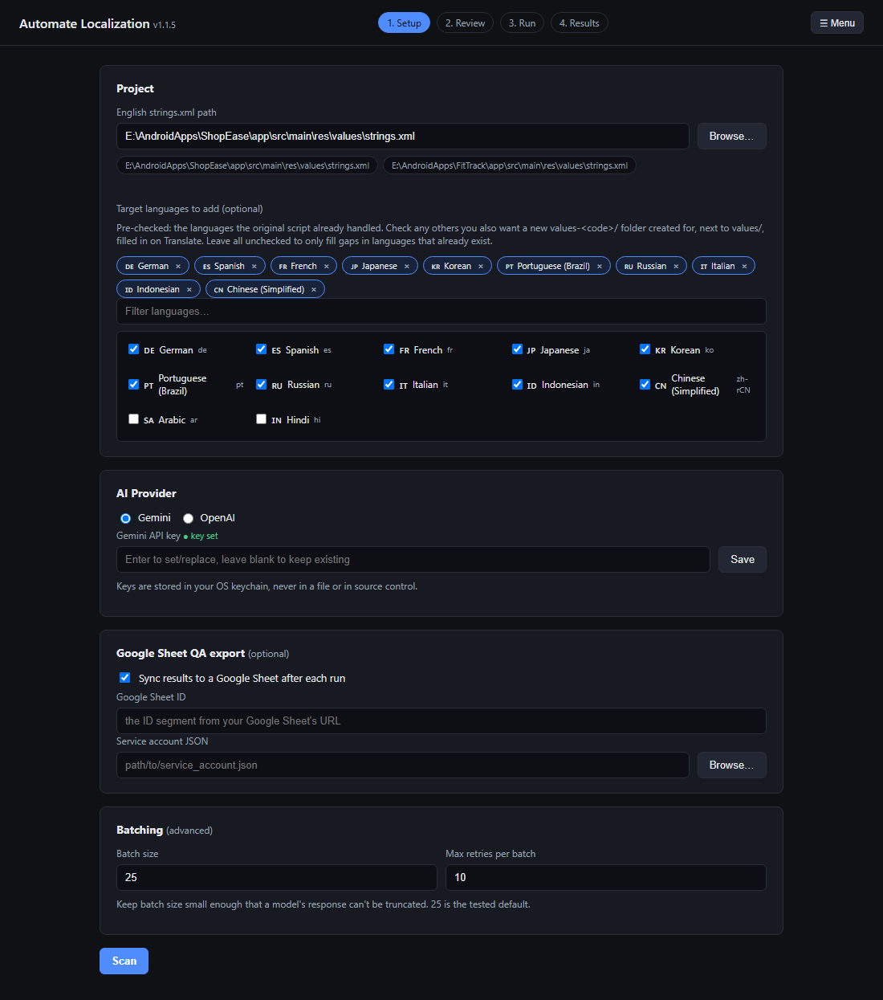
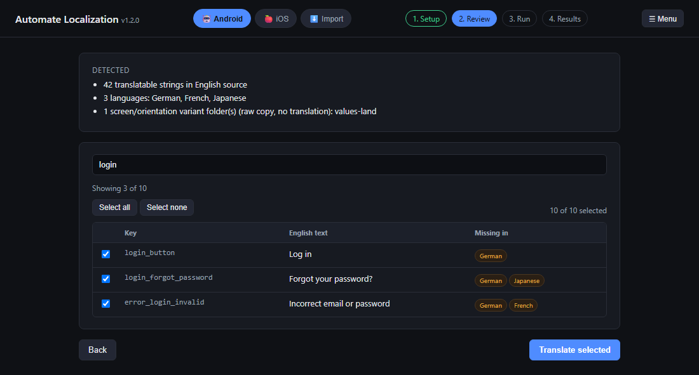
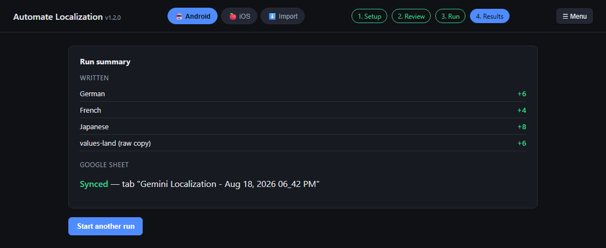
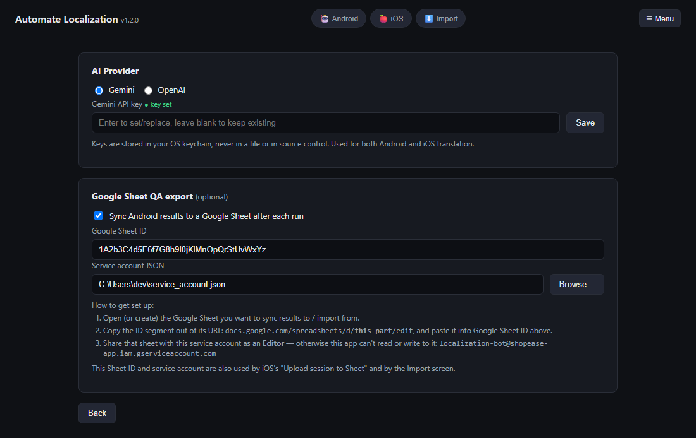
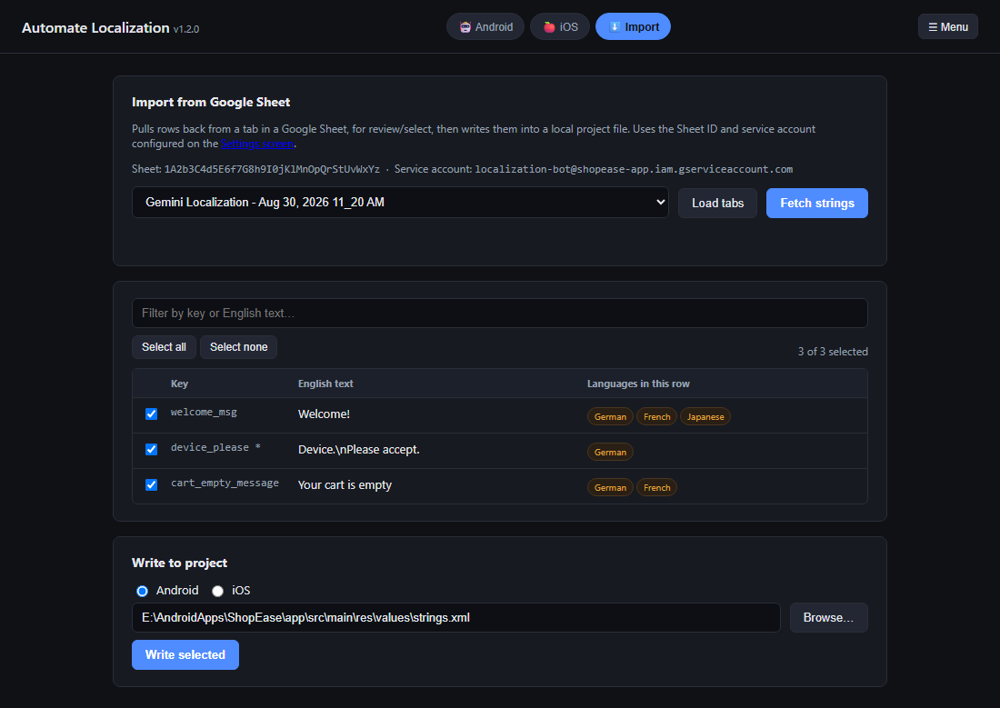
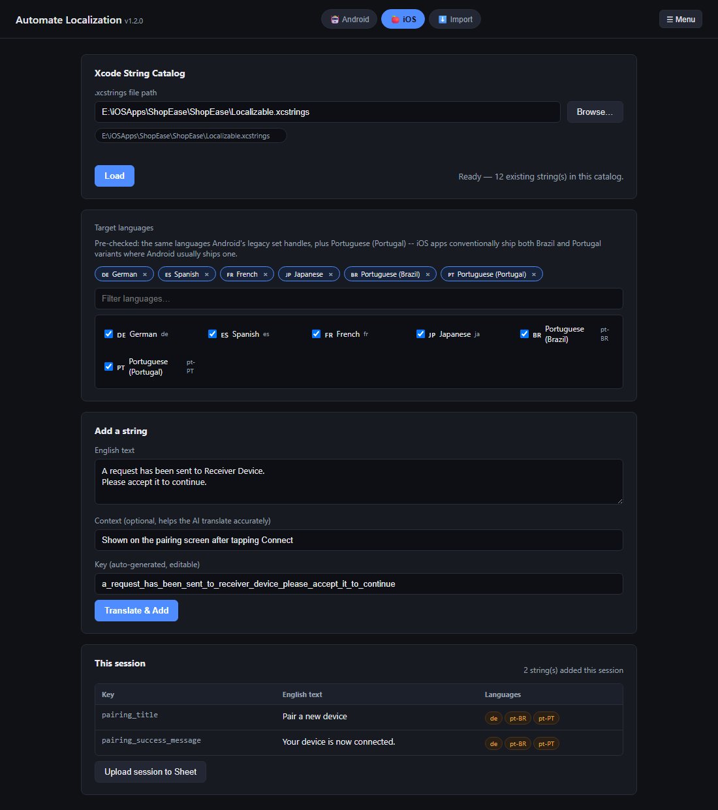

# Automate Localization

[](https://github.com/adnaanaeem/Automate-Localization/releases/latest/download/AutomateLocalizationSetup.exe)
[](https://github.com/adnaanaeem/Automate-Localization/releases/latest)

A desktop app that keeps your app's translations in sync — automatically,
using AI. Supports **Android** (`strings.xml`) and **iOS** (Xcode String
Catalog / `.xcstrings`).

**Android**: point it at your English `strings.xml`, and it finds every
string that's new or missing in each translated language (`values-de`,
`values-ja`, `values-fr`, ...), lets you review and pick exactly which ones
to translate, then machine-translates only those (via Gemini or OpenAI) and
writes them back into the right files — without ever touching a string
that's already translated.

**iOS**: type an English string, pick your target languages, and it's
translated into all of them in one go and appended to your `.xcstrings`
catalog — key auto-generated from the text the way iOS devs do it by hand,
one string at a time. Switch between platforms with the toggle at the top
of the app; neither one touches the other's files or settings.

**Import from Sheet**: the reverse direction — pull rows back from a tab in
your Google Sheet (after a reviewer's QA'd or edited them), pick which ones,
and write them into a local Android or iOS project file, same
never-overwrite rule as everywhere else in this app.

> **Full disclosure:** I built this purely for my own convenience, entirely by vibe-coding with Claude. I did not personally write a single line of it — didn't shoot one arrow myself. Every bug fix, every feature, every questionable variable name: all Claude. I just kept saying "yes, do that" and occasionally "no, not like that."



<table>
<tr>
<td width="50%"></td>
<td width="50%"></td>
</tr>
<tr>
<td width="50%"></td>
<td width="50%"></td>
</tr>
</table>

## Why

Keeping Android localizations in sync by hand doesn't scale: every time a new
string is added to the English source, someone has to notice it's missing in
a dozen other languages and translate it. This tool automates that gap-fill
step while staying safe:

- **Never overwrites existing translations** — only fills in what's actually missing, per language, independently.
- **Never silently drops a string** — translations are sent in small batches with automatic retries, and anything still missing after retries is reported, not lost.
- **Never corrupts a file it can't parse** — if a language file fails to parse, it's skipped entirely with a warning rather than guessed at.
- **You choose what gets translated** — a review screen shows every missing string before anything is sent to an AI provider, so you can deselect drafts or anything you'd rather write by hand.

## Features

- 🔍 **Auto-detects languages** — scans your `res/` folder for `values-*` directories and tells language folders (`values-de`) apart from device-qualifier variants (`values-land`, `values-sw600dp`, ...), which just get a raw copy of the English text instead of translation.
- ➕ **Add new languages** — pick from a searchable list of ~80 languages (with flags) to create a brand-new `values-<code>/` folder and populate it from scratch, even if it didn't exist before.
- ✅ **Review before you translate** — every missing string is listed with a checkbox and which languages it's missing in, checked by default, deselectable per-row. A filter box narrows the list by key or English text, and "select all"/"select none" respect whatever's currently filtered.
- 📊 **Live per-language progress** — see "German: 8/23 translated" update in real time as each language completes, not one opaque global bar.
- 🔑 **Two AI providers** — Gemini or OpenAI, switchable per run.
- 🔐 **Keys never touch disk** — API keys are entered once in the app and stored in your OS keychain via [`keyring`](https://pypi.org/project/keyring/), never written to a file or committed anywhere.
- 📋 **Optional Google Sheets QA export** — after a run, sync exactly the strings that were newly translated (backfilled with every language's current value for context) to a fresh tab in a Google Sheet for reviewers.
- 🔄 **Checks GitHub for updates on launch** — a banner appears if a newer release is available, with a one-click download-and-install; also available anytime from the **☰ Menu → Check for updates**.
- 🍎 **iOS, one string at a time** — type an English string, add optional context to help the AI translate it accurately, pick languages (defaults to Android's 10 plus Portuguese-Portugal, since iOS apps typically ship both Brazil and Portugal variants), and it's translated into all of them in a single call and appended to your `.xcstrings` catalog, key auto-generated from the text. Never overwrites a language already present for an existing key.
- ⬇️ **Import from Google Sheet** — the reverse direction: pick a tab, review the rows pulled back (works even for sheets with no "Key" column — a key is auto-generated from the English text), select which ones, and write them into a local Android or iOS file.
- ⚙️ **Centralized Settings** — AI provider keys and Google Sheet config live in one place (**☰ Menu → Settings**), shared by Android, iOS, and Import instead of being set up separately per screen.

## Prerequisites

- Python 3.9+
- A Gemini API key ([aistudio.google.com](https://aistudio.google.com/)) and/or an OpenAI API key ([platform.openai.com](https://platform.openai.com/))
- *(Optional, for Google Sheets sync)* a Google Cloud service account with the Sheets API enabled, and the target sheet shared with that service account's email as an Editor

## Download (Windows)

No Python required. **[Download the latest installer](https://github.com/adnaanaeem/Automate-Localization/releases/latest/download/AutomateLocalizationSetup.exe)** (`AutomateLocalizationSetup.exe`) and run it — or grab it from the [Releases page](https://github.com/adnaanaeem/Automate-Localization/releases) if you'd rather see the changelog first. It's a proper installer — Start Menu entry, optional desktop shortcut, and an uninstaller listed in "Add or Remove Programs". This is also what **☰ Menu → Check for updates** downloads and runs for you when a new version is out.

> Windows SmartScreen will likely flag it as "unrecognized publisher" the first time, since the build isn't code-signed. Click **More info → Run anyway**. This is expected for an unsigned open-source executable, not a sign of a problem — check the [Releases page](https://github.com/adnaanaeem/Automate-Localization/releases) itself, or build it yourself from source (below), if you'd rather verify first.
>
> Prefer a portable exe with no installer? Build it yourself from source (below) — `dist/AutomateLocalization.exe` isn't published as a separate release download.

## Download (macOS)

Grab `AutomateLocalization.dmg` from the [Releases page](https://github.com/adnaanaeem/Automate-Localization/releases), open it, and drag the app into `Applications`.

> The build isn't signed or notarized (no Apple Developer certificate), so Gatekeeper will refuse a plain double-click on first launch — same idea as Windows SmartScreen above. Right-click (or Control-click) the app in Finder, choose **Open**, then confirm in the dialog that appears; this is only needed the first time.

This build is produced by CI on every tagged release rather than by hand
on real Mac hardware — see the "Building it yourself" section below for
how, and open an issue if something's off.

## Run from source (Windows, macOS)

```bash
python -m pip install -r requirements.txt
python app/main.py
```

Needs Python 3.9+. Requirements are the same on both platforms — `keyring`
automatically uses macOS Keychain instead of Windows Credential Manager for
API-key storage, no extra setup needed.

## Usage — Settings

**☰ Menu → Settings** holds everything shared across all three platform
screens: your Gemini/OpenAI API key(s) (saved to your OS keychain, not a
file) and the optional Google Sheet QA export config (Sheet ID + service
account JSON, with step-by-step instructions for finding your Sheet ID and
sharing it with the service account's email). Set these up once — Android,
iOS, and Import all read from the same place, rather than each having its
own copy.

## Usage — Android

1. **Setup tab**
   - Browse to your English `strings.xml` (the one under `.../res/values/`, not the project root).
   - Optionally, check any additional languages you want new `values-<code>/` folders created for.
2. **Scan** — the app diffs every `values-xx/` folder against English, independently per language, and lists variant/unrecognized folders separately so nothing is silently skipped.
3. **Review** — every missing string is shown with a checkbox (checked by default) and which languages it's missing in. Type in the filter box to narrow the list by key or English text — handy for a large app. Deselect anything you don't want translated this run.
4. **Run** — translates only the selected strings, in batches, with live per-language progress and a log of any retries.
5. **Results** — a summary of what was written per language, anything still missing after retries (safe to rerun — it'll be picked back up on the next scan), and Google Sheet sync status.

## Usage — iOS

Switch to **🍎 iOS** with the toggle at the top of the app. This flow is
different from Android's on purpose — there's no scan/diff step, since
there's no single source file to compare against. Instead:

1. **Load a catalog** — browse to an existing `.xcstrings` file, or type a path to create a new one, then click **Load**.
2. **Pick target languages** — pre-checked with the same 10 languages Android's defaults use, plus Portuguese (Portugal) as the one extra (iOS apps conventionally ship both Brazil and Portugal variants).
3. **Add a string** — type the English text (multi-line is fine — Xcode string catalogs commonly have embedded line breaks), and optionally add context to help the AI translate it accurately (stored as the entry's Xcode "comment", same as `NSLocalizedString(..., comment:)`). The key auto-fills as you type, using the same lowercase-and-underscore convention iOS devs use by hand (editable if you want something different). Click **Translate & Add** — it's translated into every selected language in one go and appended to the catalog file, without ever overwriting a language that key already has.
4. Repeat for as many strings as you need — each one shows up in **This session** below.
5. **Upload session to Sheet** — sends everything added this session to a fresh tab in your configured Google Sheet (Sheet ID/service account from **☰ Menu → Settings**), for QA review.



## Usage — Import

Switch to **⬇️ Import** to pull rows back from a Google Sheet tab — after a
reviewer has QA'd or edited them there — and write them into a local
project file:

1. **Load tabs** — lists every tab in the Sheet configured on the Settings screen (shown read-only at the top, with a link to change it there).
2. **Pick a tab and Fetch strings** — every row with an English value is pulled back. A "Key" column is used if the tab has one; if not (or a specific row's Key cell is empty), a key is auto-generated from the English text and flagged with a `*` in the review table so it's clear it wasn't in the sheet.
3. **Review and select** — filter by key or English text, deselect anything you don't want written.
4. **Pick Android or iOS and a target file, then Write selected** — reuses the same never-overwrite write path as a normal translation run, so it never touches a key/language pair that's already there.


The **☰ Menu** (top-right) has **Settings** (AI provider keys and Google Sheet config, shared across all three screens), **Check for updates** (also runs automatically on launch — a banner appears if a newer release exists), and **About** (the developer's GitHub profile, fetched live).

## How it works, briefly

The engine (`app/engine.py`) reads the English source and every `values-*`
sibling folder, classifies each folder as a language, a device-qualifier
variant, or unrecognized, and diffs each language's existing strings against
English independently — so a language falling behind for reasons unrelated
to any other language still gets caught. Selected strings are sent to the AI
provider in small batches (so a response can never silently get truncated),
retried per-batch if some keys don't come back, then re-escaped deterministically
for Android's string-resource syntax (`\n`, `\t`, `\'`, inline HTML wrapped in
`CDATA`) before being surgically inserted into each file — existing entries
are never touched or reordered.

See [`HANDOFF.md`](HANDOFF.md) for the full design history, and
[`localize_claude.py`](localize_claude.py) for the original reference CLI
script this app's engine was ported from.

## Project structure

```
app/
  main.py       # pywebview entry point / JS-facing API
  engine.py     # Android scan/translate/write logic
  ios_engine.py # iOS translate/write logic (.xcstrings) -- separate from engine.py, see its module docstring for why
  sheet_import.py # reads rows back from a Sheet tab, writes into Android/iOS files -- the reverse of the two sync paths above
  config.py     # local settings + OS-keychain API key storage
  providers.py  # Gemini/OpenAI client setup
  updater.py    # checks GitHub Releases, downloads + launches the installer
  version.py    # single source of truth for the app version
  icon.ico      # app icon (exe, window/taskbar, installer)
  web/          # frontend (plain HTML/CSS/JS, no framework)
installer/
  setup.iss     # Inno Setup script -- builds the Windows installer
scripts/
  make_icon.py  # regenerates app/icon.ico
localize_claude.py  # original reference CLI script
requirements.txt
requirements-build.txt        # adds pyinstaller, for building the .exe yourself
AutomateLocalization.spec     # PyInstaller build recipe
```

## Building it yourself

The Releases page always has the latest prebuilt Windows installer and
macOS `.dmg` — both are built and attached automatically by
[`.github/workflows/release.yml`](.github/workflows/release.yml) whenever
a `vX.Y.Z` tag is pushed (bump `app/version.py` and `installer/setup.iss`'s
`MyAppVersion` together, commit, then `git tag vX.Y.Z && git push --tags`;
CI refuses to build if the tag and `app/version.py` disagree). Trigger the
same build manually from the **Actions** tab (`workflow_dispatch`, no tag
needed) to test the pipeline without publishing anything. If you'd rather
build locally instead:

```bash
python -m pip install -r requirements-build.txt
python -m PyInstaller AutomateLocalization.spec --noconfirm
```

On Windows this writes `dist/AutomateLocalization/` — the executable plus
an `_internal/` folder it needs sitting next to it (an intentional choice,
not a stray folder to clean up — see `AutomateLocalization.spec`'s comment
for why this isn't a single-file build). On macOS it writes a proper
`dist/AutomateLocalization.app` bundle instead (same spec file, branches on
`sys.platform` at build time).

To also build the **Windows installer**, you'll additionally need [Inno Setup](https://jrsoftware.org/isinfo.php)
(free), then:

```bash
"C:\Program Files (x86)\Inno Setup 6\ISCC.exe" installer\setup.iss
```

which writes `dist_installer\AutomateLocalizationSetup.exe`.

To build the **macOS `.dmg`** yourself, on a Mac:

```bash
mkdir -p dist_dmg
cp -R "dist/AutomateLocalization.app" dist_dmg/
ln -s /Applications dist_dmg/Applications
hdiutil create -volname "Automate Localization" -srcfolder dist_dmg -ov -format UDZO dist_installer/AutomateLocalization.dmg
```

**Screenshots** in this README (`docs/screenshots/`) are generated, not
hand-captured — `scripts/demo.html` is a copy of `app/web/index.html` with
a fake `window.pywebview.api` layer (realistic sample data) so the real UI
can be rendered headlessly, one screen per `?screen=` value:

```bash
python -m http.server 8935 --directory .
# then, per screenshot (screen = setup | review | results | settings | ios | import):
"C:\Program Files (x86)\Microsoft\Edge\Application\msedge.exe" --headless=new --disable-gpu --user-data-dir="%TEMP%\edge_shot" --window-size=1100,1500 --screenshot="docs\screenshots\setup.png" "http://localhost:8935/scripts/demo.html?screen=setup"
```

A dedicated `--user-data-dir` matters — without it, if a normal (non-headless)
Edge window is already running, the headless invocation just hands off to
that instance and exits without ever taking the screenshot.

If `index.html`'s markup changes, re-copy its `<body>` into `demo.html`
(everything between the mock-api `<script>` and the trailing `app.js` script
tag is untouched) before regenerating — see the comment at the top of that
file. Screenshots are captured taller than needed (so content of any length
fits); trim the padding with `python scripts/crop_screenshots.py` (needs
`pip install Pillow`) after generating all of them. Re-run both steps after
any visible UI change so the README doesn't go stale.

## Security

- API keys live only in your OS keychain (`keyring`) — never in a file, never committed.
- `config.json` (recent paths, non-secret settings) and `service_account.json` are git-ignored; they never leave your machine.
- If you're setting up your own fork, replace the placeholder `GOOGLE_SHEET_ID`/paths in `localize_claude.py` with your own before running it standalone — the desktop app itself takes these as user input, not hardcoded values.

## License

No license has been chosen yet — until one is added, all rights are reserved by the author.
